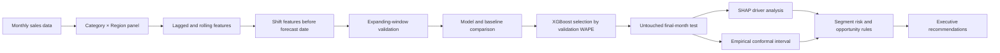

# Sales Analytics Executive & Machine Learning Dashboard

> An end-to-end Power BI portfolio project that moves from operational reporting to executive decision support, interpretable machine learning, forecast uncertainty, and segment-level recommendations.


## Executive Summary

This project analyzes three years of sales performance and converts the results into a five-page decision system for operational users, analysts, managers, and executives. It combines interactive Power BI reporting with an externally validated XGBoost forecast snapshot, SHAP-based model interpretation, uncertainty intervals, and rule-based segment risk classification.

The strongest feature is not simply the forecast. The project demonstrates how to communicate **what happened, why it matters, what may happen next, how uncertain the prediction is, and what management should do**.

## Business Questions Answered

- How are total sales, profit, quantity, and average transaction value changing?
- Which regions, products, and categories are driving growth or decline?
- Is value growth coming from higher volume or a change in transaction mix?
- Which product-region-category combinations deserve management attention?
- What is the next-period sales outlook?
- How reliable is the forecast compared with a simple seasonal baseline?
- Which historical signals influence the model most?
- Which segments should be classified as opportunities, high risk, stable, or monitor?

## Dashboard Architecture

| Page | Audience | Main Purpose |
|---|---|---|
| **1. Operational Level** | Sales and operations teams | Daily sales monitoring, customer and product detail, transaction value, gender and regional filters |
| **2. Technical Dashboard** | Analysts and reporting teams | Time-series, regional, category, quantity, and matrix-based analytical views |
| **3. Strategic Dashboard** | Managers | Yearly sales, sales-versus-purchase context, product profitability, monthly regional trends, and KPI monitoring |
| **4. Executive Insights** | Executives and decision-makers | Growth, profitability, exceptions, normalized comparisons, contribution analysis, and management actions |
| **5. Predictive Analytics & Recommendations** | Executives, analysts, and data science reviewers | XGBoost forecast, uncertainty, model validation, SHAP drivers, risk flags, recommendations, and limitations |

## Page 4 — Executive Insights

The Executive Insights page combines headline KPIs with visuals designed for management interpretation rather than only reporting.

### KPI Layer

- Total sales
- Total profit
- Profit margin
- Sold quantity
- Average transaction value
- Sales year-over-year growth

### Analytical Visuals

- **Product performance scatter:** compares product sales, profit, unit scale, and category.
- **Contribution waterfall:** explains the yearly sales journey by category.
- **Regional year comparison:** makes direct regional differences visible.
- **Normalized product comparison:** compares average transaction value rather than relying only on total scale.
- **Region × category context matrix:** provides raw and normalized metrics in one view.
- **Interactive slicers:** date, region, category, product, and gender.

### Verified 2023 Findings

- Sales reached **1.675B**, only **+0.015%** versus 2022.
- Profit reached **837.49M**.
- Sold quantity declined **0.18%** while average transaction value increased **0.23%**, indicating that the small sales increase came from mix/value rather than volume expansion.
- **Bago** remained the largest region at **495.56M**.
- **NayPyiTaw** added **15.48M** year over year, while **Yangon** declined **10.19M**.
- **Orange** generated **542.18M** and grew **4.97%**.
- **Durian** declined **5.66%**, the largest product contraction.
- The **Sour** category added **11.44M**, offsetting declines in Natural and Sweet.
- Orange led average transaction value at **308.23K**; Apple led unit volume but had the lowest average transaction value at **20.18K**.

### Management Interpretation

The dashboard recommends protecting Orange and Grapes availability, investigating Durian and Yangon softness, and validating whether NayPyiTaw growth is repeatable before making large resource commitments.

## Page 5 — Predictive Analytics & Recommendations

This page extends the historical dashboard into a structured predictive decision layer.

### Forecast Snapshot

| Metric | Result |
|---|---:|
| Selected model | **XGBoost** |
| Next-period forecast | **137.66M** |
| Forecast period | **January 2024** |
| Change vs. December 2023 actual | **+5.91%** |
| 80% lower bound | **107.60M** |
| 80% upper bound | **167.73M** |
| Interval width | **43.7% of forecast** |
| Confidence interpretation | **Low precision — directional signal** |

### Out-of-Sample Model Performance

| Metric | XGBoost Result |
|---|---:|
| MAE | **1.757M** |
| RMSE | **2.053M** |
| WAPE | **16.22%** |
| Valid MAPE | **18.34%** |
| Out-of-sample R² | **0.073** |
| Seasonal-naïve WAPE | **22.00%** |
| Improvement over seasonal naïve | **26.26%** |

The model outperformed the validation baselines and the untouched seasonal-naïve test. However, the low out-of-sample R² and wide interval mean the point prediction should be used as a **prioritization signal**, not as a guaranteed budget value.

## Machine Learning Methodology



### Leakage Prevention and Validation

- Every lag and rolling feature is shifted so that future information is not used to predict the past.
- Model selection uses chronological **expanding-window validation**.
- Validation covers **July–November 2023**.
- December 2023 data through December 30 remains untouched until model selection is fixed.
- The final model is compared against a seasonal-naïve baseline.
- An empirical conformal-style 80% interval communicates forecast uncertainty.

This validation design is more realistic than a random train/test split for time-series forecasting.

## Explainable AI with SHAP

The dashboard presents global SHAP importance so reviewers can understand the strongest predictive signals.

Top documented drivers include:

1. Recent twelve-month sales average — mean absolute SHAP approximately **533K**
2. Lagged sold quantity — approximately **214K**
3. Additional lagged quantity signal — approximately **149K**
4. Sales two months earlier — approximately **133K**
5. Average transaction value — approximately **116K**

SHAP contributions are treated correctly as **predictive explanations**, not causal effects. The project does not claim that changing a feature will automatically cause sales to change by its SHAP value.

## Risk and Opportunity Framework

The predictive layer translates model outputs into decision categories.

- **Opportunity:** forecast growth is at least 5%, and the lower uncertainty bound is above the latest actual value.
- **High Risk:** forecast decline is at least 5%, and the upper uncertainty bound is below the latest actual value.
- **Monitor:** interval width is above 25% or absolute growth exceeds 10%, meaning confirmation is required.
- **Stable:** no material risk, opportunity, or uncertainty rule is triggered.

### Highlighted Segments

| Classification | Segment | Forecast | Expected Change | 80% Interval |
|---|---|---:|---:|---:|
| Opportunity | Natural / Bago | **12.68M** | **+32.2%** | **10.17M–15.19M** |
| Opportunity | Sweet / Taunggyi | **9.70M** | **+51.1%** | **7.20M–12.21M** |
| High Risk | Natural / NayPyiTaw | **11.48M** | **-18.6%** | **8.98M–13.99M** |

Recommended actions include validating inventory and capacity for opportunity segments, investigating demand, pricing, availability, and customer loss for high-risk segments, and avoiding large commitments where uncertainty remains wide.

## Data Model and Analytical Fields

The Power BI semantic structure includes:

- A central sales data table
- A dedicated Calendar table
- A measure-support table
- Date-based filtering and time analysis

Key fields represented in the report include:

- Order date and month-year
- Product and category
- Region
- Purchase amount
- Sold quantity
- Total amount / sales
- Profit
- Average transaction value
- Customer and gender attributes
- Last price of the day

## Skills Demonstrated

### Business Intelligence

- Multi-level dashboard design for operational, technical, strategic, and executive audiences
- Data modeling and calendar-based analysis
- KPI design and business metric interpretation
- Interactive slicers, matrices, scatterplots, waterfalls, trend charts, and normalized comparisons
- Clear separation between descriptive, diagnostic, and predictive analytics

### Data Analysis

- Year-over-year comparison
- Product, region, and category performance analysis
- Mix-versus-volume interpretation
- Exception identification
- Raw-versus-normalized metric comparison
- Evidence-based management recommendations

### Machine Learning and Model Governance

- Time-aware forecasting
- XGBoost model selection
- Baseline benchmarking
- Leakage prevention
- Out-of-sample evaluation
- WAPE, MAPE, MAE, RMSE, and R² interpretation
- SHAP explainability
- Conformal-style prediction intervals
- Rule-based risk classification
- Transparent limitations and confidence communication

1. **Operational visibility** — what is happening now?
2. **Strategic analysis** — where are performance differences coming from?
3. **Executive interpretation** — what matters most?
4. **Predictive modeling** — what may happen next?
5. **Uncertainty communication** — how confident should management be?
6. **Explainability** — what signals drive the forecast?
7. **Action design** — what should the business investigate or prioritize?
8. **Governance** — what limitations prevent overconfidence?


## Important Limitations

- The dataset contains only **36 months**, which limits the depth of time-series learning.
- December 2023 ends on **December 30**, so the final test month is one day short of month-end.
- Promotion, stock availability, pricing events, holidays, competitor behavior, and macroeconomic features are not available.
- Profit margin remains near 50%, so profit ranking often mirrors sales ranking.
- Wide forecast intervals indicate low point-estimate precision.
- The Power BI historical visuals respond to native slicers, while the XGBoost KPI, SHAP, risk, and narrative panels are a validated fixed training snapshot rather than dynamically retrained model outputs inside the semantic model.
- The current ZIP contains the Power BI portfolio file and this README; external training scripts and model-output CSV files are not included in this upload.

These limitations are intentionally disclosed because reliable analytics requires communicating what the model **cannot** prove, not only displaying its strongest result.

## How to Open the Project

1. Install a current version of **Microsoft Power BI Desktop**.
2. Download or extract this portfolio package.
3. Open `Sales_Analytics_Executive_ML_Dashboard.pbix`.
4. Review the report in page order from Operational Level through Predictive Analytics & Recommendations.
5. Use the report slicers on historical pages to explore date, region, category, product, and gender performance.

## Repository Structure

```text
Sales_Analytics_Executive_ML_Portfolio/
├── Sales_Analytics_Executive_ML_Dashboard.pbix
└── README.md
```

---

**Portfolio focus:** Power BI • Business Intelligence • Data Analysis • Forecasting • Explainable AI • Decision Support
